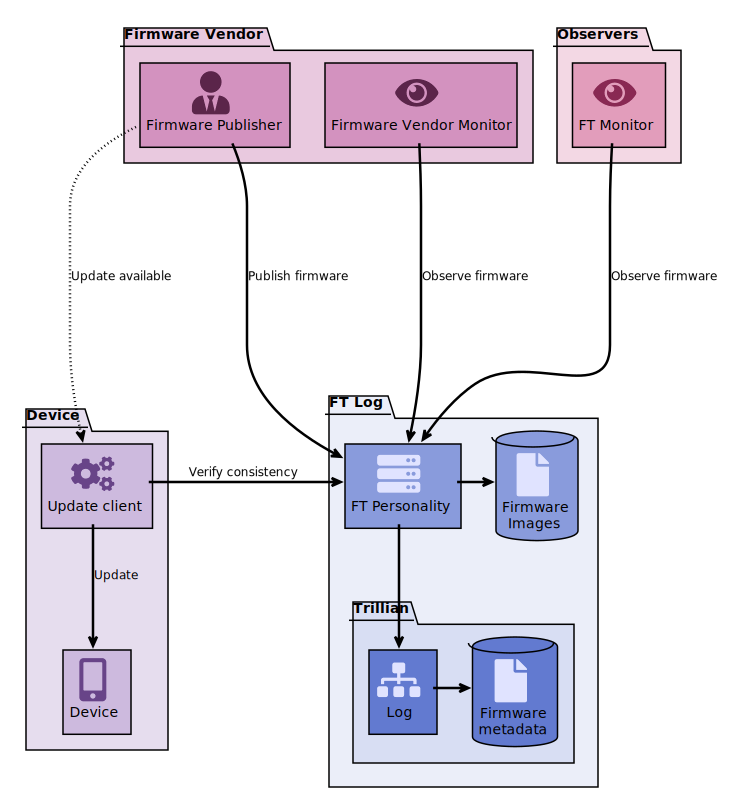

# Firmware Transparency demo design

This doc gives an overview of the design for this Firmware Transparency (FT)
demo.

## Threat model

1. Insider risk:
   An attacker has privileged control over what gets built into firmware
  images, or is able to leverage/coerce action from legitimate employees.
  1. Subvert code-review process (force push)
     No access to firmware signing key, but can attempt to quietly modify
     the source tree.
     Notes:
         * should be visible with code-review enforcement, commit audit etc.
         * FT enables impact to be known (how many, and which builds were
           affected)
  1. Build firmware from patched tree
     Able to modify source tree prior to build pipeline, no direct access to
     firmware signing key, but pipeline will result in signed firmware.
     Notes:
         * Patched builds must be logged, or they are useless.
         * FT enables discoverability for automatic detection if reproducible
           builds are possible, and manual forensic inspection if not. Either
           way, evidence is publicly available.
  1. Full control of signing key.
     Able to sign arbitrary firmware images outside of any existing controls
     or audit.
1. External/down-stream supply chain:
     This group of attacks is mostly mitigated through the use of signed
     firmware.
  1. Compromised firmware download server (e.g. CDN)
     Can replace/modify firmware update files made available for download/
     distribution.
         * DoS/block updates
         * Rollbacks
  1. On-path adversary for firmware downloads
     Can intercept and modify firmware update downloads.
1. Device-local risk
  1. Compromised local-machine used to update device firmware
     Attacker can modify downloaded firmware update files, and run arbitrary
     code on local machine used to update firmware on target device.
         * Can DoS/block updates
         * Rollback updates?
  1. Physical access to low-level interfaces on target device
     Attacker has arbitrary access to the device whose firmware is to be
     updated.
1. TODO(al): flesh this out.

## Claimant Model

To help reason about the security properties of the demo system, we'll frame
the problem in terms of the
[claimant model](https://github.com/google/trillian/master/docs/claimantmodel).

### Assumptions/Requirements
**All firmware metadata & image bytes are publicly available.**
For now, we'll keep things simple and assume that firmware is made freely
available by the vendor.

### Model

This model builds in the idea of a firmware manifest file while commits to the
contents of the firmware image along with some metadata.

#### **SystemFIRMWARE**:
SystemFIRMWARE talks only about the claims inherent in the signature
over the firmware made by the firmware vendor.

   * **ClaimFIRMWARE**
    _I, Vendor, claim that the firmware described by this manifest_:
      1. has cryptographic hash X
      1. is unique for the specified {device, class, version} tuple
      1. is functionally correct, and without known attack vectors _
*   **StatementFIRMWARE**: signed firmware manifest file
*   **ClaimantFIRMWARE**: firmware vendor
*   **BelieverFIRMWARE**:
     1. firmware update client
     1. target device bootloader/rom
*   **VerifierFIRMWARE**: third parties 
    These entities would check for any invalidation of the claims above.
    There are many possible types of entity who may have an interest in
    performing this role, e.g.:
      * vendor themselves (_"has my identity been compromised?"_)
      * other vendors
      * AV/analysis companies/organisations with large security teams
      * security researchers
      * large organisations who already regularly look at firmware for their
        fleet
      * governments
*   **ArbiterFIRMWARE**: 
    There's no official body, but invalidated claims would affect reputation,
    possibly draw recourse through law.

#### **SystemFIRMWARE_LOG**:
SystemFIRMWARE_LOG talks only about the claims made by the log
operator(s), and is the basis for providing _discoverability_ into
SystemFIRMWARE above.

*  **ClaimFIRMWARE_LOG**:
   _I, log operator, make available:_
      * A globally consistent, append-only log of
        **StatementFIRMWARE**
      * All firmware preimages corresponding to the
        **StatementFIRMWARE** stored in the log.
*  **StatementFIRMWARE_LOG**: log checkpoint (_"Signed tree head"_)
*  **ClaimantFIRMWARE_LOG**: log operator 
   Possible operators might be:
     * Chip IP licensor
     * SoC vendor
     * system integrator
     * members of relevant consortia
*  **BelieverFIRMWARE_LOG**:
     * **BelieverFIRMWARE**
     * **VerifierFIRMWARE**
*  **VerifierFIRMWARE_LOG**:
   Possible log verifiers (who can check the log claims above?):
     * other log operators
     * other entities from list of claimants above
     * interested enthusiasts
     * log verifiers from other Transparency ecosystems (e.g. CT, golang, etc.)
* **ArbiterFIRMWARE_LOG**:
  Who can kick a log out for misbehaving?

### Overview

The design for the demo consists of a number of different entities which play
the roles described in the claimant model above, these are shown in the
following diagram:

For clarity, the mapping of actors to claimant model roles are listed explicitly here:

**Firmware vendor**:
* ClaimantFIRMWARE

**Update client**:
* BelieverFIRMWARE
* BelieverFIRMWARE_LOG
* VerifierFIRMWARE_LOG (when used with STH Witness)

**Target device (toaster)**:
* BelieverFIRMWARE
* BelieverFIRMWARE_LOG

**Log**:
* ClaimantFIRMWARE_LOG

**STH Witness**:
* VerifierFIRMWARE_LOG

**Interested Observer**:
* VerifierFIRMWARE
* VerifierFIRMWARE_LOG

There are no Arbiters in the demo.

#### Caveats/Scope

For the purposes of the demo, the "on device" enforcement will be implemented
at the bootloader level.
Clearly, in a production system we'd expect to see this enforcement implemented
inside mask ROM, or some other similarly secure location, however for the
purpose of demonstrating the required functionality the bootloader will serve
well enough.

### Demo script
> :warning: Drafty!

The "target" demo-script is below:

#### Preparation
1. Partition SDCard:
   1. bootloader "firmware/fake ROM"
      This will validate proofs, and jump to the unikernel in `partition 2` if
      everything is good, otherwise it will light the RED LED and halt the
      device.
   1. unikernel (this is the only partition covered by firmware manifest)
      This is a simple app which simply flashes the GREEN LED.
   1. proof storage
1. flash our "fake ROM" primary boot loader onto "toaster" SD card `partition 1`

#### Happy Path
1. Build/package a simple "helloworld" unikernel which blinks an LED
1. Log it to the log
1. Note that the "interested observer" has spotted a new firmware and printed
   something out about it to `stdout`
1. Run the `update firmware on toaster` tool, which:
    1. fetches STH from STH witness
    1. verifies signatures on:
       1. Firmware manifest
       1. STHdevice (the on-device STH used to install the current
          firmware)
       1. STHupdate (the STH provided with the firmware update)
       1. STHwitness (the STH fetched from the witness)
    1. verifies that STHdevice, STHupdate, and
       STHwitness are on a single timeline  
      _(note that care must be taken if relationship STHdevice <=
      STHupdate <= STHwitness does not hold)_
    1. verifies inclusion of `Firmware manifest` under STHupdate
    1. if successful, writes:
       1. Firmware image to SDCard `partition 2`
       1. Firmware manifest, STHupdate & inclusion proof to SD card `partition 3`
1. reboot, device loads "bootloader" from SD `partition 1`, which:
    1. verifies signature on STHupdate
    1. verifies signature on Firmware manifest
    1. verifies inclusion proof for manifest
    1. verifies _measurement_ of SD card `partition 2` matches manifest
    1. if successful, jumps into unikernel -> blinky LED \o/

#### Sad Path
1. Modify `unikernel` source, rebuild, but **DON'T** log it
1. Show that `update firmware on toaster` tool fails because no inclusion proof
   is present
1. Re-run `update tool` with `--force` flag and supply proofs from earlier
   build
1. Reboot, observe that the bootloader fails to verify the proofs, and sets
   the big RED LED and halts the device.

#### Return To Happiness
1. Update `unikernel` source again, and rebuild, this time **DO* log as we
   originally did
1. Note that the `Interested Observer` again spots the new firmware, flash to
   device
1. Reboot, and note the unikernel is running and flashing the GREEN LED.

#### Other Sad Paths
There are some more Sad Paths we can explore in order to highlight security
properties of the system, e.g.:
1. Split view by log
   Fork the log and show that the install client is unable to verify consistency between the update, device, and witness STHs.
   For a tighter system which prevents against a compromised update client, the STH witness responses can be stored along with proofs on the device such that the device itself does the "consensus" algorithm to figure out which of the witness STHs should be used.
