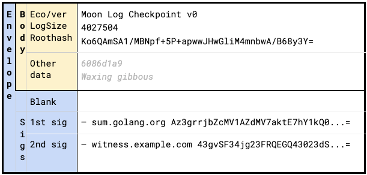

# Checkpoint and proof format

This directory contains a description and supporting golang code for
a reusable Checkpoint and proof format which the TrustFabric team
uses in various projects.

The format itself is heavily based on the
[golang sumbdb head](https://sum.golang.org/latest), and corresponding
[signed note](https://pkg.go.dev/golang.org/x/mod/sumdb/note) formats.

## Checkpoint format

This consists of two formats: a signed envelope, and a body.

### Signed envelope

The envelope (signed note) is of the form:

* One or more non-empty lines, each terminated by "\n" (the `body`)
* One line consisting of just one "\n" (.e. a blank line)
* One or more `signature` lines, each terminated by "\n"

All signatures commit to the body only (including its trailing newline, but not
the blank line's newline - see below for an example).

The signature(s) themselves are in the sumdb note format (concrete example
below):

`– <identity> <key_hint+signature_bytes>`
where:

* `–` is an emdash (U+2014)
* `<identity>` gives a human-readable representation of the signing ID

and the `signature_bytes` are prefixed with the first 4 bytes of the SHA256 hash
of the associated public key to act as a hint in identifying the correct key to
verify with.

**Differences from sumdb note:**
Whereas the golang signed note *implementation* currently supports only Ed25519
signatures, the format itself is not restricted to this scheme.

### Checkpoint body

The checkpoint body is of the form:

```xml
<Ecosystem+version string>
<Decimal log size>
<Base64 log root hash>
[otherdata]
```

The first 3 lines of the body **MUST** be present in all Checkpoints.
`otherdata` is opaque and optional, and, if necessary, can be used to tie extra
data to the checkpoint, however its format must conform to the sumdb signed
note spec (e.g. it must not contain blank lines.)

> Note that golang sumdb implementation is already compatible with this
`[otherdata]` extension (see
<https://github.com/golang/mod/blob/d6ab96f2441f9631f81862375ef66782fc4a9c12/sumdb/tlog/note.go#L52>).

The first signature on a checkpoint must be from the log which issued it.

**Differences from sumdb root:**
The sumbdb note has `go.sum database tree` as its ecosystem string.

## Example

An annotated example signed checkpoint in this format is shown below:

> 

The log size is 4027504, in the `opaque` section a timestamp is encoded as a 64bit hex value, and further application-specific data relating to the phase of the moon at the point the checkpoint was issued is supplied following that.

## Log proof format

The individual proof hashes are base64 encoded and written one per line, with the first line containing the proof node closest to the leaves, and the final line containing the proof node closest to the root.

E.g.:

```base64
Xa/RR4kVQaZZiL5oa3epz0H4dgtdELmfCd3bpTyZVnA=
Ttyc3PF7pqtMA2pnZdyr0QC9zeIz6h/U5TPI6r692rk=
sX6VR8ws2ZrACLQsdOb/zHA1rLYNSmtXi6RdkwH0Ud0=
```
