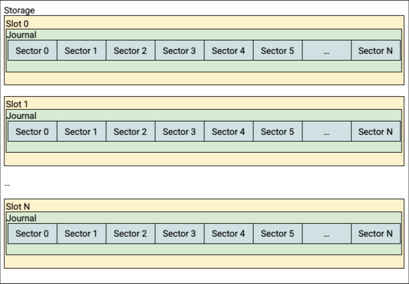
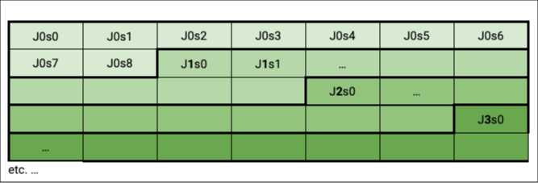

# Storage

This directory contains a work-in-progress storage system for use with
the USBArmory.
It should be considered experimental and subject to change!

Some details on the requirements and design of the storage system are below.

### Requirements

*   Allow the witness unikernel to persist small amounts of data, think multiple independent records of up to a few MB.
*   Allow the use of either the eMMC or SD card as storage
*   Avoid artificially shortening the life of storage hardware (flash)
*   Persisted state should be resilient to corruption from power failure/reboot during writes

#### Nice-to-haves

*   Be somewhat reusable for other USBArmory drive use cases we may have.
    *   This probably means being able to store different types of data in specified locations.
#### Non-requirements

*   While we're ultimately limited by the performance of the storage hardware, it's not a priority to achieve the lowest possible latency or highest possible throughput for writes.
*   Integration with Go's `os.Open()` style APIs (this _would_ be great, but would require upstream work in TamaGo so is explicitly out of scope for now).

#### Out-of-scope

Some things are explicitly out of scope for this design:

*   Attacker modifying the data on the storage in some out-of-band fashion,
*   Hardware failure resulting in previously readable data becoming unreadable/corrupted,
*   Supporting easy discovery / enumeration of data on disk, or preventing duplicate data from being written. Higher level code should be responsible for understanding what data should be in which slots.

### Design

A relatively simple storage API which offers a fixed number of "storage slots" to which a representation of state can be written. Slot storage will be allocated a range of the underlying storage, starting at a known byte offset and with a known length. This slot storage is also preconfigured with the number of slots that it should allocate (or alternatively/equivalently, the number of bytes to be reserved per-slot).

Each slot is backed by a fixed size "journal" stored across _N_ eMMC sectors. 

Logically it can be thought of like so:



Physically it may look like this on the MMC block device itself (8 sectors per journal is just an example):



#### API

The API tries to be as simple as possible to use and implement for now - e.g. since we're only intending this to be used for O(MB) of data, it's probably fine to pass this to/from the storage layer as a straight `[]byte` slice.

However, if necessary, we could try to make the API more like Go's io framework, with `Reader` and `Writers`.


```go
// Partition describes the extent and layout of a single contiguous region 
// underlying block storage.
type Partition struct {}

// Open opens the specified slot, returns an error if the slot is out of bounds.
func (p *Partition) Open(slot int) (*Slot, error)


// Slot represents the current data in a slot.
type Slot struct {}

// Read returns the last data successfully written to the slot, along with 
// a token which can be used with CheckAndWrite.
func (s *Slot) Read() ([]byte, uint32, error)

// Write stores the provided data to the slot.
// Upon successful completion, this data will be returned by future calls 
// to Read until another successful Write call is mode.
// If the call to Write fails, future calls to Read will return the 
// previous successfully written data, if any.
func (s *Slot) Write(p []byte) error 

// CheckAndWrite behaves like Write, with the exception that it will 
// immediately return an error if the slot has been successfully written 
// to since the Read call which produced the passed-in token.
func (s *Slot) CheckAndWrite(token uint32, p []byte) error

```

#### Internal structures

Data stored in the slot is represented by an _"update record"_ written to the journal.

The update record contains:

Field Name   | Type                        | Notes
-------------|-----------------------------|-------------------------
`Magic`      |`[4]byte{'T', 'F', 'J', '0'}`| Magic record header, v0
`Revision`   |`uint32`                     | Incremented with each write to slot
`DataLen`    |`uint64`                     | `len(RecordData)`
`Checksum`   |`[32]byte{}`                 | `SHA256` of `RecordData`
`RecordData` |`[DataLen]byte{}`            | Application data


An update record is considered _valid_ if its:

*   `Magic` is correct,
*   `Checksum` is correct for the `RecordData`

The first time `Open` is called for a given slot, the slot's journal will be scanned from the beginning to look for the valid update record with the largest `Revision`. The Data from this record is the data associated with the slot. It could potentially be cached in RAM at this point if it's small enough.

If no such record exists, then the slot has not yet been successfully written to and there is no data associated with the slot.

An update to the slot causes an update record to be written to the journal starting at either:

*   The first byte of the sector following the extent of the "current" update record (i.e all sectors contain header/data for at most 1 record), if there is sufficient space remaining in the journal to accommodate the entire update record without wrapping around to the first sector, or
*   The first byte of the first sector in the journal, if there is no current record or the update record will not fit in the remaining journal space.

Following a successful write to storage, the metadata associated with slot (i.e. Revision, current header location, location for next write, etc.) is updated.

The diagram below shows a sequence of several update record writes of varying data sizes. These writes are taking place in a single journal, which you'll remember comprises several sectors.

The grey boxes represent sectors containing old/previous data, green represents sectors holding the latest successful write.

The numbers indicate a header with a particular `Revision`, sectors with `…` contain follow-on `RecordData`, and an x indicates invalid record header:

```
⬛⬛⬛⬛⬛⬛⬛⬛⬛⬛ - Initial state, nothing written
🟩🟩🟩⬛⬛⬛⬛⬛⬛⬛ - First record (rev=1) has been successfully stored
⬜⬜⬜🟩🟩⬛⬛⬛⬛⬛ - Next record (rev=2) is stored with the next available block
⬜⬜⬜⬜⬜🟩🟩🟩⬛⬛ - Same again.
🟩🟩🟩⬜⬜⬜⬜⬜⬛⬛ - The 4th record will not fit in the remaining space, so is written starting at the zeroth sector, overwriting old revision(s) - note it does not wrap around.
⬜⬜⬜🟩🟩🟩⬜⬜⬛⬛ - Subsequent revisions continue in this vein.
```

Since record revisions should always be increasing as we scan left-to-right through the slot storage, we can assume we've found the newest update record when we've either reached the end of the storage space, or after having read at least 1 _good_ update record we find a record with a lower `Revision` than the previous record, or one with an invalid `Magic` or `Checksum.`

#### Failed/interrupted writes

For a failed write to the storage to have any permanent effect at all, it must have succeeded in writing at least the 1st sector of the update record, and so the stored header checksum will be invalid. This allows the failure to be detected when reading back with high probability.

The maximum permitted `RecordData` size is restricted to `(TotalSlotSize/3) - len(Header)`; this prevents a failed write obliterating all or part of the previous successful write, so unless the failed write is the first attempt to write to the slot, there will always be a valid previous record available (modulo storage fabric failure).

Adding records with failed writes:

```
⬜⬜⬜🟩🟩🟩⬜⬜⬜⬛ - Initial state, record (rev=3) is valid and current.
🟩🟩🟩⬜⬜⬜⬜⬜⬜⬛ - Update to (rev=4).
🟩🟩🟩🟥🟥🟥⬜⬜⬜⬛ - Attempt to write (rev=5) fails, corrupting (rev=2) and (rev=3), but rev=4, the current good record, is intact.
⬜⬜⬜🟩🟩🟩⬜⬜⬜⬛ - Application successfully writes (rev=5)...
⬜⬜⬜⬜⬜⬜🟩🟩🟩⬛ - ... and (rev=6)
🟥🟥🟥⬜⬜⬜🟩🟩🟩⬛ - Fail to write (rev=7) located at the zeroth sector, but (rev=6) is intact. 
```

#### Other properties

This journal type approach affords a couple of additional nice properties given the environment and use case:

1. A very basic notion of "wear levelling" is present, since writes are spread out across most sectors.
2. The API can provide _check-and-set_ semantics: _"Write an update record with revision X, iff the current record is revision X-1"_.

#### Trade-offs

##### SD vs eMMC

The USB Armory has both of these types of storage available. They are both built upon similar technology - they both use flash as the underlying storage mechanism. Flash memory has a limited number of write-cycles which may be performed per-cell, after this the cell becomes unreliable. Currently, most flash cells are rated to around 10,000 write cycles. At just one write every 5 minutes to a single cell, that cell will survive for less than 35 days.

Wear-levelling is a mechanism for working around this limited number of writes per cell.

The **SD card** specification does not require that the card provides wear-levelling functionality directly, which means that it's up to the operating-system/unikernel to ensure that repeated writes to the same logical block are spread evenly across the flash cells.

The **eMMC** spec, on the other hand, does require that the integrated controller provide transparent wear-levelling.

##### Space efficiency vs SD card life

A simple A/B partition scheme would require a lower storage overhead cost, however this approach would also focus write-wear on the first block(s) of these partitions.

The approach described above ensures that write wear is more evenly distributed across all blocks (albeit with some room for improvement towards the tail end of the journal alloc due to the simple wrapping scheme used.)
